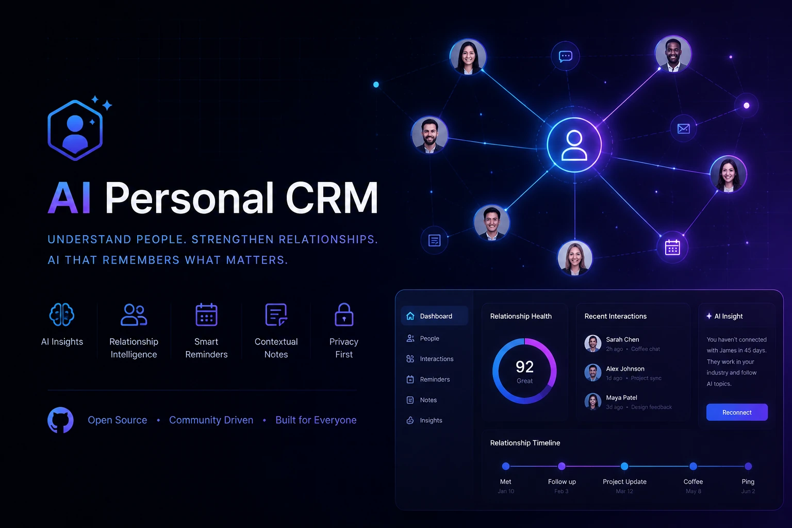

# AI Personal CRM




## Table of Contents
- [Introduction](#introduction)
- [Features](#features)
- [How It Works](#how-it-works)
- [Tech Stack](#tech-stack)
- [Architecture](#architecture)
- [Project Structure](#project-structure)
- [Installation](#installation)
- [AI Configuration](#ai-configuration)
- [Database Models](#database-models)
- [Use Cases](#use-cases)
- [Roadmap](#roadmap)
- [Contributing](#contributing)
- [License](#license)
- [Author](#author)
- [Final Note](#final-note)

---

## Introduction
**AI Personal CRM** is a modern AI-powered Personal CRM that helps you manage relationships more effectively.

It records interactions with people and uses AI to analyze conversations, detect relationship signals, and suggest intelligent follow-ups.

Instead of manually tracking relationships, the system helps you:
- Understand interaction sentiment  
- Detect important relationship signals  
- Know when to follow up  
- Receive smart suggestions for communication  

This project demonstrates how LLMs can be used to build intelligent relationship management tools.

---

## Features

### Contact Management
- Create and manage contacts  
- View relationship history  
- Track all interactions  

### Interaction Logging
Record interactions such as:
- Meetings  
- Calls  
- Conversations  
- Messages  
- Personal notes  

### AI Interaction Analysis
The AI analyzes interaction text and extracts:
- Sentiment (positive / neutral / negative)  
- Interaction type  
- Key discussion topics  
- Relationship signals  
- Follow‑up needs  

### Smart Follow‑Up Suggestions
The AI generates suggestions including:
- Recommended action  
- Follow-up timing  
- Priority level  
- Relationship insight  

---

## How It Works
1. User creates a contact  
2. User logs an interaction  
3. Interaction text is sent to the AI model  
4. AI analyzes the interaction  
5. Extracted insights are stored  
6. AI generates follow-up suggestions  

---

## Tech Stack

### Frontend


- Next.js (App Router)  
- React  
- TypeScript  
- Tailwind CSS  

### Backend


- Laravel
- Next.js Server Actions  
- API Routes  

### Database


- Prisma ORM  
- SQLite  

### AI


- OpenAI-compatible APIs  
- LLM structured output parsing  

---

### Architecture
```
User Interface (Next.js / React)
        │
        ▼
Server Actions
        │
        ▼
Prisma ORM
        │
        ▼
SQLite Database
        │
        ▼
AI Model (OpenAI Compatible API)

```
## AI is used primarily for:

- Interaction analysis
- Relationship signal extraction
- Follow‑up recommendation generation

---

### Project Structure
```
ai-personal-crm
│
├── app
│   ├── actions
│   │   ├── analyzeInteraction.ts
│   │   ├── generateSuggestion.ts
│   │   └── interactions.ts
│   │
│   ├── api
│   │   └── test-ai
│   │
│   ├── contacts
│   │   └── [id]
│   │       ├── page.tsx
│   │       ├── InteractionForm.tsx
│   │       └── AISuggestionSection.tsx
│   │
│   ├── dashboard
│   │   └── page.tsx
│   │
│   ├── layout.tsx
│   ├── page.tsx
│   └── globals.css
│
├── lib
│   ├── prisma.ts
│   ├── openai.ts
│   └── followUp.ts
│
├── prisma
│   ├── schema.prisma
│   ├── migrations
│   └── seed.ts
│
├── package.json
├── tsconfig.json
├── next.config.ts
└── README.md

```
---

### Installation

## Clone the repository
```
git clone https://github.com/your-username/ai-personal-crm.git
cd ai-personal-crm

```
---

## Install dependencies
```
npm install
```
Or
```
yarn install
```
---

## Setup database
Run migrations:
```
npx prisma migrate dev
```
Seed database:
```
npx prisma db seed
```
---

## Run development server
```
npm run dev
```
Open in browser:
```
http://localhost:3000
```
---

### AI Configuration
The system supports OpenAI-compatible APIs.

Required settings:
- API Key
- Base URL
- Model Name

Example configuration:
```
API Key: sk-xxxx
Base URL: https://api.openai.com/v1
Model: gpt-4

```
You can also use providers like:

- OpenAI
- Azure OpenAI
- Local LLM APIs
- Any OpenAI-compatible service
---

## Database Models
The main Prisma models include:

### Contact
Stores information about people.

### Interaction
Stores interactions between you and a contact.

### AppSetting
Stores AI configuration such as API keys and model settings.

---

### Use Case
This project can be used for:

- Personal relationship management
- Professional networking
- Personal CRM
- Founder networking
- Relationship intelligence tools
- AI-powered contact tracking

---

### Roadmap
Planned future features:

- Authentication system
- Multi-user support
- Automatic follow-up reminders
- Calendar integration
- Relationship analytics dashboard
- Email integration
- Messaging integrations
- AI-powered relationship scoring

---

### Contributing
Contributions are welcome.

Steps:

1. Fork the repository
2. Create a new branch
3. Commit your changes
4. Submit a Pull Request

---

### License

[](LICENSE)

---

### Author

Bahram Barazandeh

---

### Final Note
This project demonstrates how AI can transform simple contact management into intelligent relationship management.
